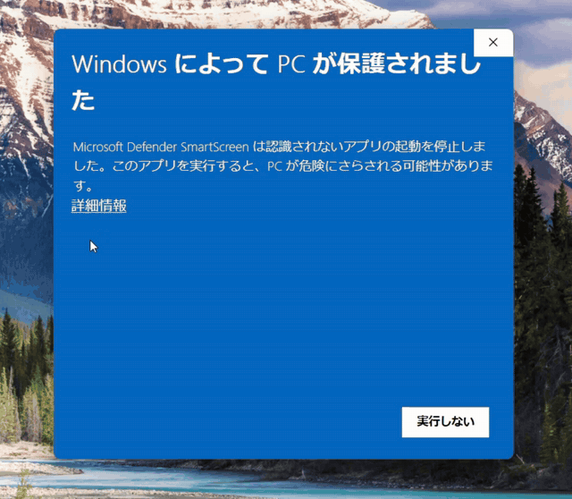
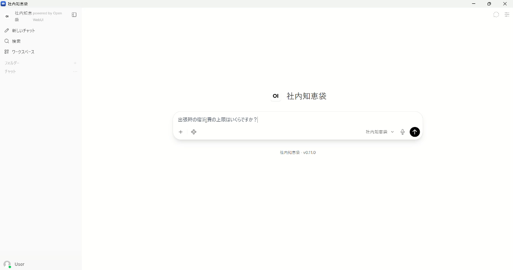
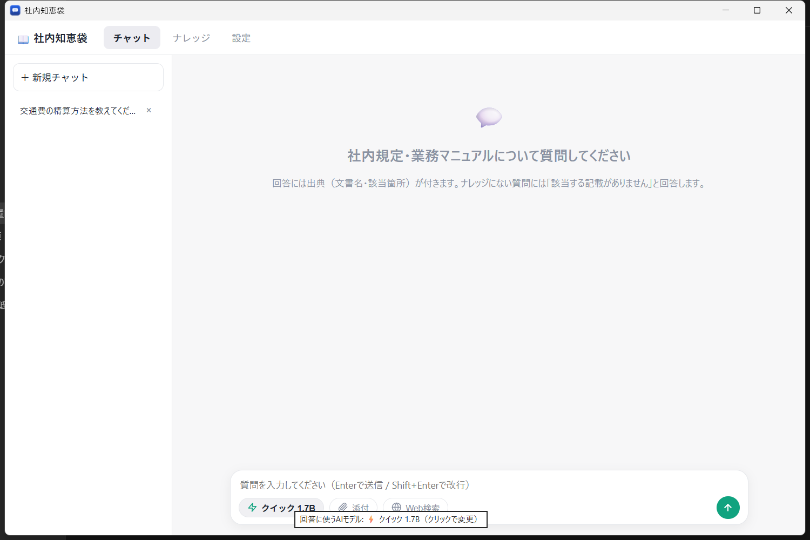
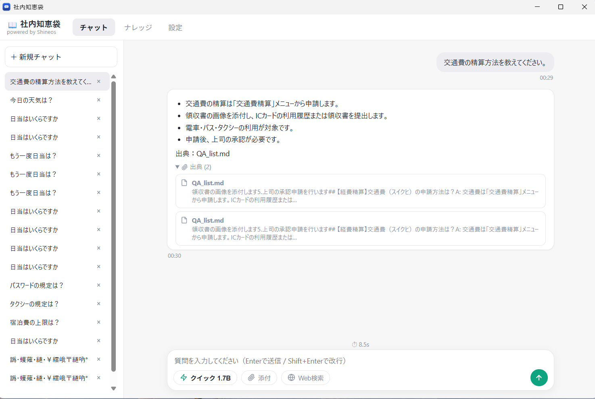
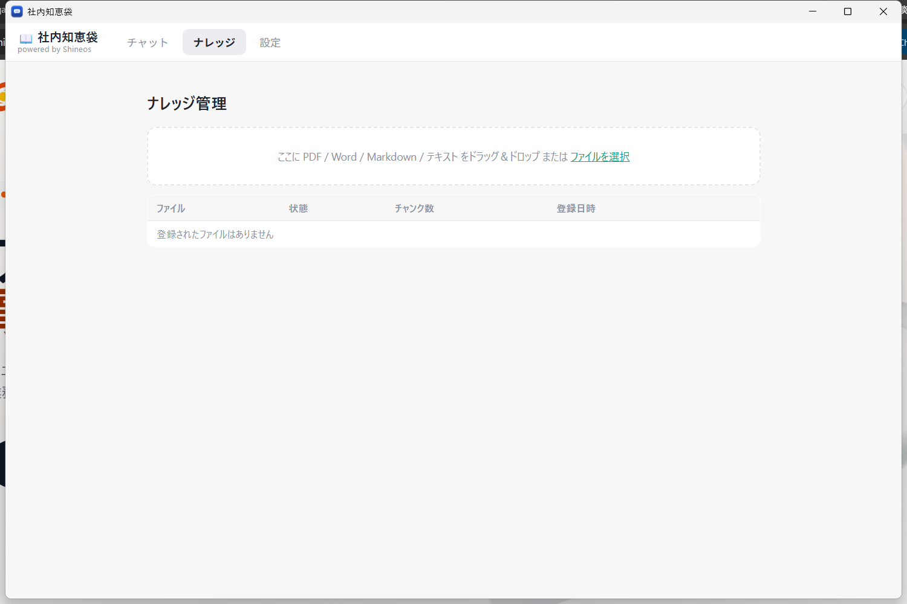
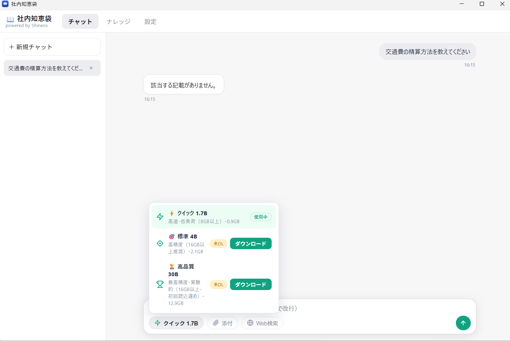

# ShineosQA (社内知恵袋 / Company Knowledge Base)

**Languages**: [日本語](README.md) | [English](README-EN.md)

**A Windows application that turns company regulations and business manuals into a searchable knowledge base, enabling internal Q&A entirely on your own PC.**

ShineosQA is an internal Q&A tool provided by [Shineos Inc.](https://shineos.com). It packages a local AI environment (Ollama + Open WebUI) so that non-technical staff can use it the moment it is installed. **Fully offline operation** — your company documents never leave the machine.

## Product Overview (for code-signing review)

**Publisher:** Shineos Inc. (https://shineos.com) — contact: https://shineos.com/contact/

**What this software does:** ShineosQA is a legitimate, privacy-focused internal knowledge-base assistant for Japanese small and medium businesses. The installer (`ShineosQA-Setup-<version>.exe`, built with Inno Setup and code-signed) sets up a completely local AI stack on the user's own PC:

- **Ollama** (MIT) — on-device LLM inference engine, installed at setup time
- **Open WebUI** (Open WebUI License, BSD-3 based) — chat UI with Retrieval-Augmented Generation, installed via pip
- **Qwen2.5 / bge-m3 models** — downloaded at setup time from the official Ollama registry
- A lightweight **WebView2 wrapper app** (C#) so users get a double-click desktop application with no URL entry

Users register their company regulations and manuals (PDF/Markdown) as "knowledge". Questions are answered **with citations** from those documents. When an answer is not found in the knowledge base, the assistant declines to answer instead of guessing (hallucination guardrails). Optional features (web search, PDF/PPTX/DOCX generation) are strictly opt-in; by default nothing is sent to any external service.

**Network behavior:** Setup downloads the components above from official sources (ollama.com, PyPI, NuGet, python.org). After installation, the application runs entirely on localhost (default port 8080) and makes **no outbound connections** unless the user explicitly enables the optional web-search toggle.

**How to get it:** Released for free from [GitHub Releases](https://github.com/Shineos/shineos-qa-assistant/releases). Source code (installer scripts, wrapper app, patches) is open under the MIT License. Paid installation support and maintenance are available from Shineos Inc.

## Features

| Feature | Description |
|------|------|
| Internal Q&A (RAG) | Answers with citations (document name and section) from your registered regulations and manuals |
| Automatic knowledge registration | Point the installer at a folder, or drag & drop files in the app at any time |
| Hybrid search | BM25 (keyword) + vector search (semantic) so model numbers and regulation IDs are found accurately |
| Purpose-built presets | One-click switching between "General", "Expense Reimbursement Guide" and "IT Helpdesk" assistants |
| Hallucination guardrails | If the knowledge base has no answer, it says so — it never invents document names or numbers |
| Response-speed tuning | Model co-residency and startup warm-up minimize the wait before each answer |
| Automatic GPU use | **NVIDIA GPUs are used automatically** for much faster answers; machines without one run on CPU (auto-detected at install) |
| Friendly to other apps | On CPU-only machines, CPU priority control and RAM-adaptive memory keep your PC responsive; GPU machines favor speed since CPU load is low |
| Fully offline | Company documents never leave the PC — suitable for confidential material |
| Auto start | Runs as a Windows service after each reboot |
| Web search (OFF by default) | Optional DuckDuckGo lookup (no API key). **Queries would be sent externally, so keep it OFF for company questions** |
| File generation | Optionally generate PDF / PowerPoint / Word files from chat |

## Requirements

- Windows 10 / 11 (64-bit)
- 8 GB RAM or more (16 GB recommended)
- 15 GB free disk space
- Internet connection **during installation only** (about 6 GB of downloads: Ollama 1.5 GB, AI models ~3.4 GB, etc. — downloads run in parallel and it takes roughly 15–40 minutes depending on your connection)
- Answers take a few seconds to ~20 seconds (all processing is local). The product specializes in regulations/manuals Q&A; general-knowledge questions are declined with "not found in the knowledge base"

## Download & Install

Download the latest `ShineosQA-Setup-<version>.exe` from the [Releases](https://github.com/Shineos/shineos-qa-assistant/releases/latest) page and **double-click it**.

1. Choose an AI model as guided:
   - **qwen2.5:3b (recommended)** — ~1.9 GB, comfortable even on 8 GB machines
   - **qwen2.5:7b (higher quality)** — ~4.7 GB, 16 GB+ RAM recommended
   - **qwen2.5:1.5b (lightweight)** — ~1 GB, fastest
2. Optionally point to a folder of company documents (you can add more later in the app)
3. After setup, double-click the "社内知恵袋" desktop icon — the app opens with no URL entry; closing it stops the service

> Note: builds are currently signed with a test certificate, so Windows SmartScreen may show an "unrecognized app" warning. Choose **"More info" → "Run anyway"** in that case.

## Usage

1. Type a question such as "What is the procedure for expense reimbursement?" in the input box
2. Answers include citations (document name and section)
3. Add documents any time via the "ナレッジ (Knowledge)" menu — just drag & drop

See the **[user guide (Japanese)](docs/user-guide.md)** for details.

## Screenshots

### Installation flow (animated)

The actual flow from launching the installer to completion (3x speed).

### Usage demo (animated)

The actual flow from question to a cited answer, recorded from real usage.

### App screens

| Screen | Description |
|------|------|
|  | **Main screen** — opens from the desktop icon, no URL entry needed |
|  | **Answer with citation** — "15,000 yen (tax incl.) per night" shown together with the source document (QA_list.md) |
|  | **Knowledge management** — review and add company documents (PDF / Markdown) |
|  | **Purpose-built presets** — "Expense Reimbursement Guide", "IT Helpdesk" and more |

## Licensing & Support

- **The product itself is free** (MIT License, provided as-is)
- **Paid installation support & maintenance** is available from Shineos Inc.: https://shineos.com/contact/
- Internally powered by the open-source **Open WebUI** (the "powered by Open WebUI" label in the UI is an attribution). Third-party licenses are listed in [vendor/THIRD-PARTY-NOTICES.txt](vendor/THIRD-PARTY-NOTICES.txt)

## Documentation

| Document | Contents |
|------|------|
| [README.md](README.md) | Japanese product page |
| [User guide (Japanese)](docs/user-guide.md) | Daily usage, adding knowledge, troubleshooting |
| [Technical notes (Japanese)](docs/technical-notes.md) | Memory/speed tuning, how the RAG patches work, upgrades, smoke tests |
| [Build docs (Japanese)](docs/build.md) | Build, test and release procedures (for developers) |
| [CHANGELOG.md](CHANGELOG.md) | Version-by-version changes |
| [Code Signing Policy](CODE_SIGNING.md) | What is signed, build/signing pipeline, team roles (SignPath Foundation requirements) |
| [Privacy Policy](PRIVACY.md) | No telemetry, network access breakdown, local data storage |

## Contact

- Bug reports, installation support, customization: https://shineos.com/contact/
