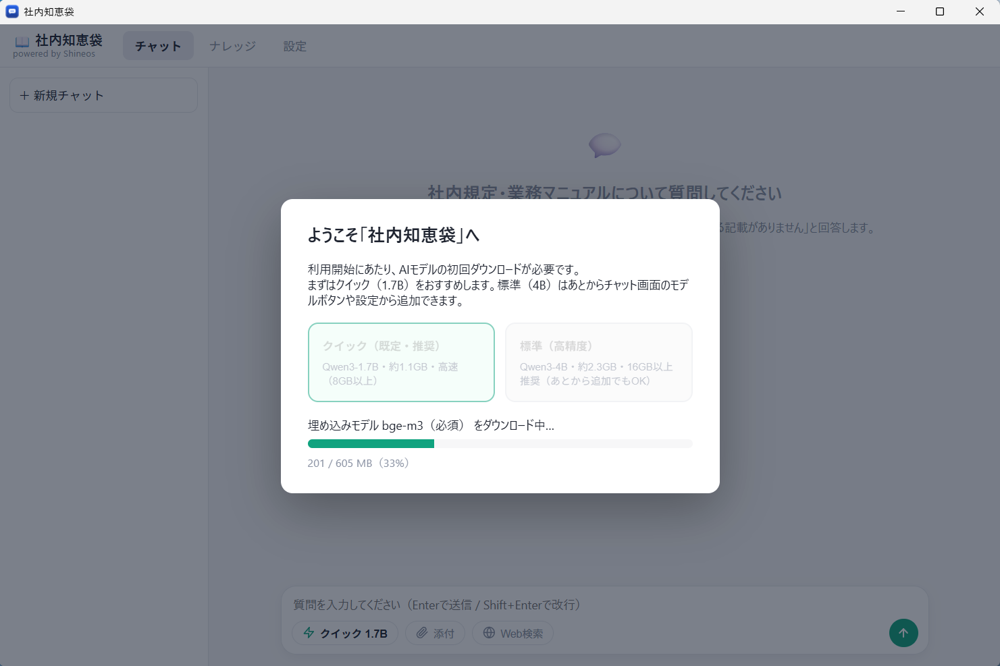

# ShineosQA (社内知恵袋 / Company Knowledge Base)

**Languages**: [日本語](README.md) | [English](README-EN.md)

**A Windows application that turns company regulations and business manuals into a searchable knowledge base, enabling internal Q&A entirely on your own PC.**

ShineosQA is an internal Q&A tool provided by [Shineos Inc.](https://shineos.com). It runs **llama.cpp directly behind a lightweight custom C# backend with a TypeScript UI in WebView2**, with no Python runtime and no resident web service — so even low-spec PCs get fast answers, and closing the app releases all memory. **Company documents never leave the machine**.

## Product Overview (for code-signing review)

**Publisher:** Shineos Inc. (https://shineos.com) — contact: https://shineos.com/contact/

**What this software does:** ShineosQA is a legitimate, privacy-focused internal knowledge-base assistant for Japanese small and medium businesses. The installer (`ShineosQA-Setup-<version>.exe`, built with Inno Setup and code-signed) sets up a completely local AI stack on the user's own PC:

- **llama.cpp** (MIT) — official prebuilt `llama-server.exe`, executed directly by the app (no intermediary)
- **Qwen3 models** (Apache-2.0) — downloaded from Hugging Face as GGUF files with SHA-256 verification; the quick 1.7B model is bundled in the installer
- **bge-m3 / bge-reranker-v2-m3** (MIT) — local embedding and reranking models for retrieval
- A lightweight **custom backend** (C#, single executable with embedded SQLite) serving a **TypeScript chat UI** inside a WebView2 desktop shell — a double-click desktop app with no URL entry

Users register their company regulations and manuals (PDF/Word/Excel/CSV/Markdown/text) as "knowledge". Questions are answered **with citations** from those documents. When an answer is not found in the knowledge base, the assistant declines to answer instead of guessing (hallucination guardrails). The optional web-search toggle is strictly opt-in; by default nothing is sent to any external service.

**Network behavior:** Setup may download models from Hugging Face (or use the bundled 1.7B model, which needs no download). After installation, the application runs entirely on localhost (default port 8300) and makes **no outbound connections** unless the user explicitly enables the optional web-search toggle.

**How to get it:** Released for free from [GitHub Releases](https://github.com/Shineos/shineos-qa-assistant/releases). Source code is open under the MIT License. Paid installation support and maintenance are available from Shineos Inc.

## Features

| Feature | Description |
|------|------|
| Internal Q&A (RAG) | Answers with citations (document name and section) from your registered regulations and manuals |
| Knowledge registration | Drag & drop files in the "Knowledge" tab (PDF / Word / Excel / CSV / Markdown / text), or attach them right from the composer |
| Hybrid search | BM25 (keyword) + vector search (semantic) so model numbers and regulation IDs are found accurately |
| Reranking | Candidates are re-scored with bge-reranker-v2-m3; high-confidence hits skip reranking for speed, and adjacent chunks are joined so context is never cut mid-sentence |
| Three answer tiers | ⚡Quick (1.7B) / 🎯Standard (4B) / 🏆Quality (30B) — switch instantly from the composer; undownloaded models can be fetched from the same menu |
| Hallucination guardrails | If the knowledge base has no answer, it says so — it never invents document names or numbers |
| Fast responses | Preload + warm-up at startup, stable prompt prefix (prefix caching), and an answer cache for repeated questions |
| Stop on close | Closing the app stops the AI engine, backend and network ports completely and releases all memory (nothing stays resident) |
| Fully offline | Company documents never leave the PC — suitable for confidential material |
| Web search (OFF by default) | Optional DuckDuckGo lookup (no API key). **Queries would be sent externally, so keep it OFF for company questions** |
| Drawing PDF search & Q&A (manufacturing extension, enable in Settings) | Auto-reads the title block (part number, name, material, revision) of drawing PDFs at ingest; part-number variants (A-1234 / A1234 / full-width) match as the same token. **DXF (CAD exchange format)** files can also be ingested directly (DWG is not supported — export to DXF/PDF). Paste a screen capture to ask from a drawing number (on-device OCR). OFF by default |
| AI reading of drawing captures (`Win+Shift+S` → paste) | The vision-language model (Qwen3-VL, processed on-device) reads part number, name, material and revision straight from the capture image and pre-fills the confirmation chip (more accurate than WinRT OCR; one-tap correction). Download from Settings → AI models (~2.1 GB, optional) |
| Shape-only captures also work | Even a crop of just the drawing geometry (no text at all) works: the AI reads shape cues as search keywords, and sending with no typed text is supported |
| Source preview with on-drawing highlight | Clicking a drawing source shows the original page with the cited region highlighted; "Open original file" opens the real PDF/DXF |
| Chat management (stored captures & archive) | Captures are stored locally and shown again when you reopen old chats. Unused chats can be 📦 archived instead of deleted (restorable anytime) |

### Key changes from the previous release (Ollama + Open WebUI)

| Item | Previous | Current |
|------|----|----|
| AI engine | Ollama (with intermediary layers) | **llama.cpp executed directly** (llama-server, no intermediary) |
| App layer | Open WebUI + Python + source patches | **One custom lightweight backend executable** (embedded SQLite, no patches) |
| Install size | ~6 GB total, 15–40 min | **~2.1 GB with bundled starter model, a few minutes** (extra models downloaded later) |
| Memory | Python etc. consumed ~2 GB resident | **Zero resident overhead** — freed RAM goes to the model (4B runs on 8 GB machines) |
| Time to first token | Varied by model and state | **~4 s** with Quick 1.7B; repeated questions **under 0.2 s** (CPU-only, measured) |
| Model switching | Chosen in the installer (changing meant re-download) | **Switch instantly in the app** (undownloaded models download from the same menu) |
| Resident service | Windows service running at all times | **~2 s startup, full stop on close** (nothing runs in the background) |

## Requirements

- Windows 10 / 11 (64-bit) — **no GPU required** (CPU only)
- 8 GB RAM or more (16 GB+ lets you use the 🏆Quality 30B model)
- Free disk space: full installer ~3 GB for the initial install (⚡Quick bundled). Microsoft Store build: ~0.2 GB install + ~2.3 GB first-launch model download. Adding 🎯Standard 4B takes ~2.5 GB more; 🏆Quality 30B ~14 GB
- Internet connection is only needed to fetch AI models (the full installer bundles them, so installation itself is fully offline; the Store build fetches them on first launch)
- Answers take a few to ~15 seconds (all processing is local). The product specializes in regulations/manuals Q&A; general-knowledge questions are declined with "not found in the knowledge base"

## Download & Install

Download the latest `ShineosQA-Setup-<version>.exe` from the [Releases](https://github.com/Shineos/shineos-qa-assistant/releases/latest) page and **double-click it** (no admin rights needed — installs per user; ~2.2 GB download with the starter models bundled, fully offline install). **Microsoft Store distribution is in preparation** — the Store build uses a small installer (~47 MB) and downloads the AI models (~2.3 GB) in the app on first launch (see the first screenshot in the [gallery](#screenshots) below).

1. ⚡Quick (Qwen3-1.7B, IQ4_XS quantization) is **bundled with the installer**, so the app is ready immediately after setup
2. 🎯Standard (4B) and 🏆Quality (30B) can be downloaded later from the model menu or the settings tab — only if you need them
3. After setup, double-click the "社内知恵袋" desktop icon — the app opens in about 2 seconds (no URL entry; closing it stops every related process)

Silent installation (`/VERYSILENT`) is supported.

> Note: the direct-download build is currently signed with a test certificate, so Windows SmartScreen may show an "unrecognized app" warning. Choose **"More info" → "Run anyway"** in that case. The Microsoft Store build will not show this warning.

## Usage

1. Type a question such as "What is the procedure for expense reimbursement?" in the input box
2. Answers include citations (document name and section)
3. Add documents any time via the "ナレッジ (Knowledge)" tab — just drag & drop (newly added documents are searchable immediately)
4. Use the model button at the bottom-left of the composer to switch between ⚡Quick / 🎯Standard / 🎯Quality

## Screenshots

| Screen | Description |
|------|------|
|  | **First-launch model download (Microsoft Store build)** — a welcome wizard lets you pick ⚡Quick (1.7B) or 🎯Standard (4B), then downloads the required models (~2.3 GB for Quick) with a progress bar. Fully offline afterwards (the full installer bundles the models, so this step does not apply) |
|  | **Main screen** — opens from the desktop icon in ~2 seconds, no URL entry needed |
|  | **Answer with citation** — the answer is shown together with its sources, and past Q&A can be reopened from the history |
|  | **Knowledge management** — register and review company documents (PDF / Word / Excel / CSV / Markdown / text) by drag & drop |
|  | **Model selection** — switch between ⚡Quick (1.7B) / 🎯Standard (4B) / 🏆Quality (30B) instantly; undownloaded models download from here |

## Measured performance (reference)

On the development machine (Ryzen 7 5700U, 8 cores/16 threads, 15 GB RAM, no GPU, CPU only):

| Item | ⚡Quick 1.7B | 🎯Standard 4B | 🏆Quality 30B |
|------|--------------|----------|-------------|
| New question: time to first token | ~3.5–4.6 s | ~8–9 s | ~11–14 s |
| Repeated question | under 0.2 s (answer cache) | under 0.2 s | under 0.2 s |
| App start → ready to type | ~2 s (including model preload + warm-up) | | |

An 18-scenario quality test across 4 configurations found no degradation from the lightweight IQ4_XS quantization (see the [verification report, Japanese](spikes/phase0/latency-cmp/RESULTS.md)).

## Licensing & Support

- **The product itself is free** (MIT License, provided as-is)
- **Paid installation support & maintenance** is available from Shineos Inc.: https://shineos.com/contact/
- Powered by open-source components: llama.cpp, Qwen3, bge-m3, bge-reranker-v2-m3. Third-party licenses are listed in [vendor/THIRD-PARTY-NOTICES.txt](vendor/THIRD-PARTY-NOTICES.txt)

## Documentation

| Document | Contents |
|------|------|
| [README.md](README.md) | Japanese product page |
| [Architecture design (Japanese)](docs/architecture-v2.md) | Design goals, structure and technology choices of the current architecture |
| [Development guide (Japanese)](docs/dev-v2.md) | Build, test and development procedures |
| [Latency verification (Japanese)](docs/latency-verification.md) | Measured speedups of the current fast configuration vs the previous release |
| [Regression test (Japanese)](docs/regression-test.md) | Quality/speed comparison against the previous release |
| [Error codes (Japanese)](docs/error-codes-v2.md) | Exit codes and error handling |
| [CHANGELOG.md](CHANGELOG.md) | Version-by-version changes |
| [Code Signing Policy](CODE_SIGNING.md) | What is signed, build/signing pipeline, team roles (SignPath Foundation requirements) |
| [Privacy Policy](PRIVACY.md) | No telemetry, network access breakdown, local data storage |

Documents from the previous release era (Ollama + Open WebUI) — [user guide](docs/user-guide.md), [technical notes](docs/technical-notes.md), [build docs](docs/build.md), [exit codes](docs/exit-codes.md) — are kept as archives describing that stack.

## Contact

- Bug reports, installation support, customization: https://shineos.com/contact/
